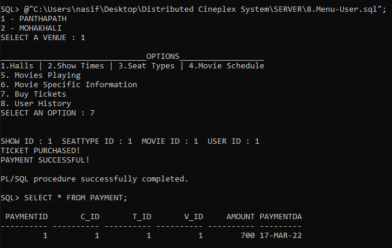
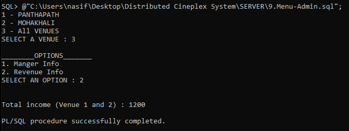

# Distributed Cineplex System
An automated cineplex management system which is capable of handling most of the ticket-related and scheduling operations in a distributed manner.  
## `User Part`   
 
## `Admin Part`   
 
